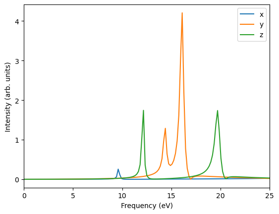
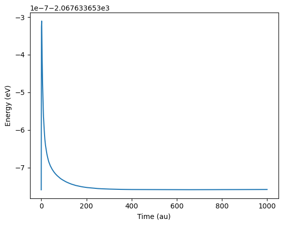
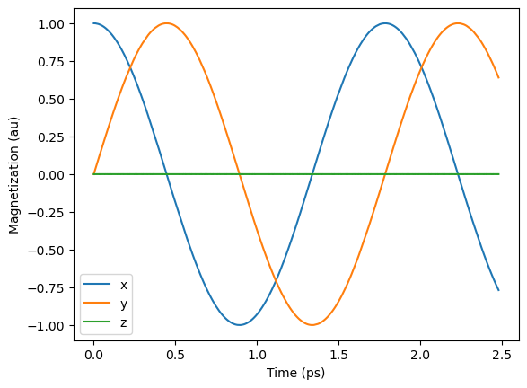
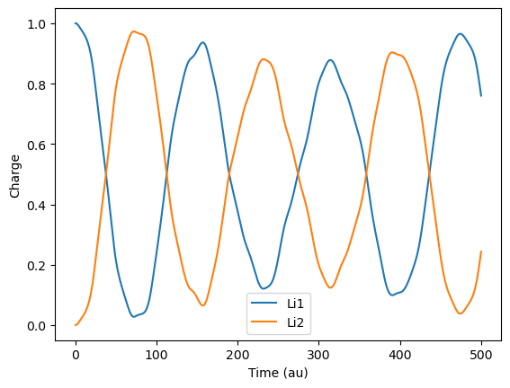
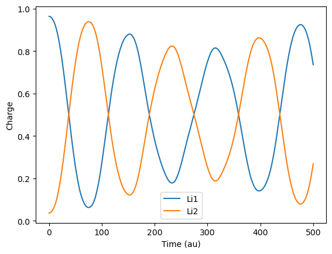
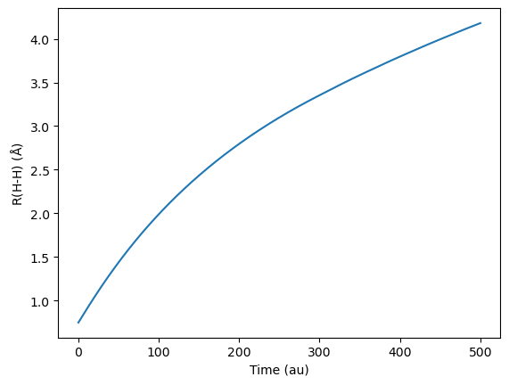
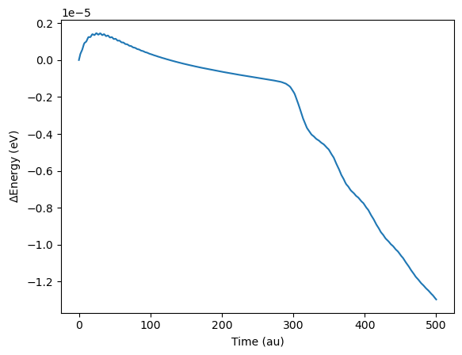

# TiDES
(Real-Time) **Ti**me-**D**ependent **E**lectronic **S**tructure


TiDES is an open-source package for real-time electronic structure simulations. It interfaces with the functionality of PySCF.

## How to install:

```
pip install git+https://github.com/jskretchmer/TIDES
```

** For better (much better) performance, install an optimized BLAS library, otherwise PySCF will end up looking for BLAS on it's own (often finding a slow version). For conda users, an easy way to do this is by installing scipy through conda.
```
conda install scipy
```


## How to start a calculation:
(See worked examples below)
1. Build mol
2. Create SCF object (can be a restricted, unrestricted, or generalized Hartree Fock or Density Functional Theory object - RHF, UHF, GHF, RKS, UKS, or GKS)
3. Run the SCF calculation
4. Create a RT_SCF or RT_Ehrenfest object, sending the static SCF object as an argument along with the propagation parameters.
5. Declare the observables you wish to calculate.
6. Define and add any external fields.
7. Start propagation

## Ehrenfest Dynamics
For Ehrenfest dynamics calculations, use the derived RT_Ehrenfest class instead of the base RT_SCF class. Upon instantiation, provide additional parameters to define the timesteps associated with the nuclear propagation.

## Propagation parameters
timestep

max_time

frequency
- How often observables are printed. Default is 1, corresponding to a print out at every time step.

verbosity
- We use the same logger defined in PySCF.
- Default verbosity is 3.
- Verbosity levels are as follows
  - 0: Quiet
  - 1: Error
  - 2: Warn
  - 3: Note
  - 4: Info
  - 5: Debug
  - 6: Debug1
  - 7: Debug2
  - 8: Debug3
  - 9: Debug4

Ne_step
  - Only for RT_Ehrenfest objects. This determines the frequency in which nuclei positions/velocities are updated versus electronic steps.
  - Default is 10.
  - For example, if Ne_step is 10, nuclei are updated every 10 electronic steps.

N_step
- Only for RT_Ehrenfest objects. This determines the frequency in which nuclear forces are updated versus nuclei steps.
- Default is 10.
- For example, if N_step is 10, forces are updated every 10 nuclei position/velocity steps.


## Integrators
Change integrator by adjusting the rt_scf.prop attribute. The default integrator is 'magnus_interpol'

- Runge-Kutta 4 - 'rk4'
- Magnus Step (MMUT) - 'magnus_step'
- Interpolated Magnus - 'magnus_interpol'

## Observables
All observables must be declared to be printed. To declare an observable, update the observables dictionary attribute of the RT_SCF object to be True for the dictionary keys corresponding to any desired observables.

```
rt_scf.observables['energy'] = True # Energy will be printed

rt_scf.observables.update(energy=True, dipole=True) # Energy and Dipole will be printed
```


All the below observables, unless otherwise stated, will print for verbose > 2 if rt_scf.observables[key] is set to True.

- Energy - 'energy'
- Dipole - 'dipole'
- Quadrupole - 'quadrupole'
- Electronic Charge - 'charge'
- Mulliken Charge - 'atom_charge' or 'mulliken_charge' or 'mulliken_atom_charge'
- Hirshfeld Charge - 'hirsh_charge' or 'hirsh_atom_charge'
- Magnetization - 'mag'
- Hirshfeld Magnetization - 'hirsh_mag' or 'hirsh_atom_mag'
- MO occupations - 'mo_occ'
- Nuclei (For Ehrenfest) - 'nuclei'
  - Positions
  - Velocities - verbose > 3
  - Forces - verbose > 4
- Custom observables

## External Fields
Electric Field
  - Compatible with restricted + unrestricted objects
  - Includes field types defined in https://nwchemgit.github.io/RT-TDDFT.html#excite-excitation-rules

Complex Absorbing Potential
  - https://doi.org/10.1021/ct400569s
  - See custom external field section below for implementation

Static Magnetic Field

## Restarting from Chkfile
All that is needed to restart a RT calculation is the current time and the current MO coefficients. These are loaded in a 'chkfile.'

We can run a TiDES calculation that generates a chkfile for the propagation by setting the rt_scf.chkfile attribute to a filename. The file will then be generated and updated.

To restart from a chkfile, set the rt_scf.chkfile attribute to the filename of a pre-existing chkfile. The chkfile only contains the current time and current MO coefficients. So, you will need to redefine propagation parameters, external fields, etc.

See Chkfile example in src/examples

## Worked Examples
The following show some very simple example calculations. All the calculations shown below should be very quick, taking seconds or minutes to run.

### RHF Absorption Spectrum of Water
This example was originally performed as an example for NWChem's RT-TDDFT module: https://nwchemgit.github.io/RT-TDDFT.html#resonant-ultraviolet-excitation-of-water. We will essentially recreate it here, but use RHF instead of RKS.

1. First create the water mol object and a RHF object. Then run the SCF calculation.
2. Create a RT_SCF object. By default the interpolated Magnus integrator is used, which can maintain accuracy with large timesteps.
3. We'll print out the energy and dipole moment of the system at each timestep. We'll need to dipole moment to generate the spectrum.
4. To simulate absorbance spectra with real-time electronic structure methods, we simulate the dipole moment in the presence of an electric field. A convenient (albeit nonphysical) electric field is a delta impulse applied at the first time step. This weakly excites all electronic modes.
5. Run the calculation.

```
python Water_RHF_UV-Vis.py > Water_RHF_UV-Vis.pyo
```

##### Water_RHF_UV-Vis.py
```
from pyscf import gto, scf
from tides import rt_scf
from tides.rt_vapp import ElectricField

# Build mol
mol = gto.M(atom='''
  O     0.00000000    -0.00001441    -0.34824012
  H    -0.00000000     0.76001092    -0.93285191
  H     0.00000000    -0.75999650    -0.93290797
        ''', basis='6-31G')

# Build RHF object
rhf = scf.RHF(mol)

# Run SCF
rhf.kernel()

# Declare propagation parameters
rt_scf = rt_scf.RT_SCF(rhf,
timestep=1.0, max_time=1000)

# Declare observables
rt_scf.observables.update(energy=True, dipole=True)

# Add electric field
delta_field = ElectricField('delta', [0.0001, 0.0001, 0.0001])
rt_scf.add_potential(delta_field)
# It would be better to perform 3 separate simulations for fields polarized in each direction,
# but it makes a negligible difference here

# Start propagation
rt_scf.kernel()
```

6. Once the calculation is done, we can generate a spectrum. TiDES includes a parser and a simple function to transform the dipole moment to a spectrum, so we'll use both of those. We can also see the electric field pulse in the plot of energy vs. time. Note the small scale of the y-axis.

```
import matplotlib.pyplot as plt
from tides.parse_rt import parse_output
from tides.rt_spec import abs_spec

result = parse_output('Water_RHF_UV-Vis.pyo')
w, osc_str = abs_spec(result['time'], result['dipole'], 0.0001)

plt.figure()
plt.plot(w*27.2114, osc_str[:,0], label='x')
plt.plot(w*27.2114, osc_str[:,1], label='y')
plt.plot(w*27.2114, osc_str[:,2], label='z')
plt.xlabel('Frequency (eV)')
plt.xlim([0,25])
plt.ylabel('Intensity (arb. units)')
plt.legend()
plt.savefig('Water_RHF_UV-Vis_Spectrum.png', bbox_inches='tight')

plt.figure()
plt.plot(result['time'], result['energy']*27.2114)
plt.ylabel('Energy (eV)')
plt.xlabel('Time (au)')
plt.savefig('Water_RHF_UV-Vis_Energy.png', bbox_inches='tight')
```





### Magnetization Dynamics
We will recreate a GHF calculation of hydrogen in a static magnetic field. https://doi.org/10.1063/1.4902884

1. Create the mol object. Create and run a GHF object.
2. We will apply the magnetic field by modifying the core Hamiltonian of the GHF object. The staticfield module in TiDES will do this.
3. Create a RT_SCF object. Update the observables dictionary to print out the magnetization.
4. Run the calculation.

```
python H_BField.py > H_BField.pyo
```

##### H_BField.py
```
from pyscf import gto, scf, dft
from tides import rt_scf, rt_vapp
from tides.staticfield import static_bfield

'''
Hydrogen Atom in a static B-Field
Recreated from https://doi.org/10.1063/1.4902884
'''


mag_z = 0.000085 # in au

# Build mol
mol = gto.M(
    verbose = 0,
    atom='H 0 0 0',
    basis='STO-3G',
    spin = 1)

# Build and run GHF object
mf = scf.ghf.GHF(mol)
mf.kernel()

# Add BField (this overwrites the hcore)
static_bfield(mf, [0,0,mag_z])

# Create RT_SCF object
rt_mf = rt_scf.RT_SCF(mf, 0.1, 102500)

# Specify propagator
rt_mf.prop = 'magnus_step'
# In virtually all cases, the default 'magnus_interpol' is a more robust integrator.
# However the magnus_step (or MMUT) integrator is what was used in the original paper

# Declare observables, in our case we only care about the magnetization
rt_mf.observables.update(mag=True)

# Start propagation
rt_mf.kernel()
```

6. Plot the magnetization.

```
import matplotlib.pyplot as plt
from tides.parse_rt import parse_output

result = parse_output('H_BField.pyo')


plt.figure()
plt.plot(result['time'] / 41340, result['mag'][:,0], label='x')
plt.plot(result['time'] / 41340, result['mag'][:,1], label='y')
plt.plot(result['time'] / 41340, result['mag'][:,2], label='z')
plt.ylabel('Magnetization (au)')
plt.xlabel('Time (ps)')
plt.legend()
plt.savefig('H_BField_Mag.png', bbox_inches='tight')
```



### Charge Transfer
Here we will simulate charge transfer between two lithiums. We will use the strategy developed in https://nwchemgit.github.io/RT-TDDFT.html#charge-transfer-between-a-tcne-dimer where we prepare the initial dimer orbitals by combining the isolated lithium monomer orbitals. We will start the first lithium with a positive charge and the second with a neutral charge.

1. Create the mol objects. Create and run the UHF objects. Technically we don't need to run the dimer SCF, because we will end up overwriting the initial MO coefficients...
2. Using the noscfbasis function of the basis_utils module, prepare the 'NOSCF' orbitals and assign it to the dimer. This allows us to start the calculation with the positive charge localized on one lithium. This is an artificially high energy state.
3. Create a RT_SCF object. Update the observables dictionary to print out both the Mulliken and Hirshfeld atomic charges. We can eventually compare the two, although they should be roughly the same.
4. Run the calculation.

```
python Li_ChargeTransfer.py > Li_ChargeTransfer.pyo
```

##### Li_ChargeTransfer.py
```
from pyscf import gto, scf, dft
from tides import rt_scf
from tides import rt_utils
from tides import basis_utils

dimer = gto.Mole()
Li1 = gto.Mole()
Li2 = gto.Mole()

dimer.atom = '''
Li 0.0 0.0 0.0
Li 0.0 0.0 5.0
'''

Li1.atom = '''
Li 0.0 0.0 0.0
'''

Li2.atom = '''
Li 0.0 0.0 5.0
'''

dimer.basis = '6-31G*'
Li1.basis = '6-31G*'
Li2.basis = '6-31G*'

dimer.charge = +1
dimer.spin = 1
dimer.build()

Li1.charge = +1
Li1.spin = 0
Li2.charge = 0
Li2.spin = 1
Li1.build()
Li2.build()

dimer = scf.UHF(dimer)
Li1 = scf.UHF(Li1)
Li2 = scf.UHF(Li2)


dimer.kernel()
Li1.kernel()
Li2.kernel()

dimer.mo_coeff = basis_utils.noscfbasis(dimer,Li1,Li2)
rt_mf = rt_scf.RT_SCF(dimer,0.05, 500)
rt_mf.prop = 'rk4' # No good reason to use rk4, but it works with small timesteps.
rt_mf.observables.update(mulliken_atom_charge=True, hirsh_atom_charge=True)

rt_mf.kernel()
```

5. Now plot both charge types.

```
import matplotlib.pyplot as plt
from tides.parse_rt import parse_output

result = parse_output('Li_ChargeTransfer.pyo')


plt.figure()
plt.plot(result['time'], 3 - result['mulliken_atom_charge'][:,0], label='Li1')
plt.plot(result['time'], 3 - result['mulliken_atom_charge'][:,1], label='Li2')
plt.ylabel('Charge')
plt.xlabel('Time (au)')
plt.legend()
plt.savefig('Li_ChargeTransfer_Mulliken.png', bbox_inches='tight')

plt.figure()
plt.plot(result['time'], 3 - result['hirsh_atom_charge'][:,0], label='Li1')
plt.plot(result['time'], 3 - result['hirsh_atom_charge'][:,1], label='Li2')
plt.ylabel('Charge')
plt.xlabel('Time (au)')
plt.legend()
plt.savefig('Li_ChargeTransfer_Hirsh.png', bbox_inches='tight')
```




Here we notice identical behavior in the two charges (as expected) but note smoother oscillations for the Hirshfeld (bottom plot) calculated charges.

### Ehrenfest
This is an example of how to initialize an Ehrenfest calculation. We'll use molecular hydrogen for simplicity.

1. As usual, create the mol object. Create and run a UHF object.
2. Create a RT_Ehrenfest object. The instantiation of a RT_Ehrenfest is essentially the same as creating a RT_SCF object, however we will also specify N_step and Ne_step. N_step refers to how frequency the forces are updated, Ne_step refers to how frequently the nuclei are updated.
3. Update the observables dictionary to print out the energy and nuclei at each timestep.
4. We'll give the H-H bond an initial vibrational energy of 10 eV.
5. Run the calculation.

```
python H2_Ehrenfest.py > H2_Ehrenfest.pyo
```


##### H2_Ehrenfest.py
```
from pyscf import gto, scf
import numpy as np
from tides import rt_ehrenfest

# Build mol
mol = gto.M(atom='''
  H    0.0 0.0 0.0
  H    0.0 0.0 0.75
        ''', basis='6-31G')

# Build UHF object
uhf = scf.UHF(mol)

# Run SCF
uhf.kernel()

# Declare propagation parameters
rt_ehrenfest = rt_ehrenfest.RT_Ehrenfest(uhf, 0.05, 500,
        Ne_step=1, N_step=1)

# Declare observables
rt_ehrenfest.observables.update(energy=True, dipole=True, nuclei=True)

# Let's start the simulation with 5eV of vibrational energy within the H-H bond.
# KE = \sum_i{0.5 m_i v_i**2}
# v_i = \sqrt{2KE_i/m_i}
# KE_i = 5 / 2
# 1 au = 27.2114 eV
# H mass = 1836 m_e

KE_i = 5.0 # 5.0 eV for each H, giving total KE of 10.0 eV
init_velo = np.sqrt(2*(KE_i/27.2114)/1836)

# Set velocities in the z direction.
rt_ehrenfest.nuc.vel[0,2] = -1 * init_velo # Make sure velocities are in opposite directions
rt_ehrenfest.nuc.vel[1,2] = init_velo

# Start propagation
rt_ehrenfest.kernel()
```


6. If we plot the results we can see the bond distance and energy conservation in time. Note the scaling on the y-axis, reflecting decent energy conservation.

```
import matplotlib.pyplot as plt
from tides.parse_rt import parse_output, get_length
from tides.rt_spec import abs_spec

result = parse_output('H2_Ehrenfest.pyo')

HH_dist = get_length(result['coords'], [1,2])

plt.figure()
plt.plot(result['time'], HH_dist)
plt.ylabel(r'R(H-H) ($\mathrm{\AA}$)')
plt.xlabel('Time (au)')
plt.savefig('H2_Ehrenfest_Distance.png', bbox_inches='tight')

plt.figure()
plt.plot(result['time'], (result['energy'] - result['energy'][0])*27.2114)
plt.ylabel(r'$\Delta$Energy (eV)')
plt.xlabel('Time (au)')
plt.savefig('H2_Ehrenfest_Energy.png', bbox_inches='tight')
```





# Customization

## Adding Custom Fields
External potentials are classes with a method called 'calculate_potential.' Any potential classes given in rt_scf._potential will have their 'calculate_potential' called, and the returned array will be added to the Fock matrix (in the AO basis). The rt_scf object must be an argument to the 'calculate_potential' function.

Add potentials to a calculation with the rt_scf.add_potential() function.

The MOCAP defined in https://doi.org/10.1021/ct400569s is an excellent example of how to implement an external field in TiDES. The MOCAP was initially implemented in NWChem's RT-TDDFT module.


The MOCAP is defined as its own class in rt_cap.


```
class MOCAP:
    def __init__(self, expconst, emin, prefac=1, maxval=100):
        self.expconst = expconst
        self.emin = emin
        self.prefac = prefac
        self.maxval = maxval

    def calculate_cap(self, rt_scf, fock):
        # Construct fock_orth without CAP
        fock_orth = np.dot(rt_scf.orth.T, np.dot(fock,rt_scf.orth))

        # Calculate MO energies
        mo_energy, mo_orth = np.linalg.eigh(fock_orth)

        # Construct damping terms
        damping_diagonal = []

        for energy in mo_energy:
            energy_corrected = energy - self.emin

            if energy_corrected > 0:
                damping_term = self.prefac * (1 - np.exp(self.expconst* energy_corrected))
                if damping_term < (-1 * self.maxval):
                    damping_term = -1 * self.maxval
                damping_diagonal.append(damping_term)
            else:
                damping_diagonal.append(0)

        damping_diagonal = np.array(damping_diagonal).astype(np.complex128)

        # Construct damping matrix
        damping_matrix = np.diag(damping_diagonal)
        damping_matrix = np.dot(mo_orth, np.dot(damping_matrix, np.conj(mo_orth.T)))

        # Rotate back to ao basis
        transform = inv(rt_scf.orth.T)
        damping_matrix_ao = np.dot(transform, np.dot(damping_matrix, transform.T))
        return 1j * damping_matrix_ao

    def calculate_potential(self, rt_scf):
        if rt_scf.nmat == 1:
            return self.calculate_cap(rt_scf, rt_scf.fock_ao)
        else:
            return np.stack((self.calculate_cap(rt_scf, rt_scf.fock_ao[0]), self.calculate_cap(rt_scf, rt_scf.fock_ao[1])))
```

The 'calculate_potential' function is the driver function of the class, and is called when building the Fock matrix during propgation. The Water_MOCAP example (recreated from NWChem) shows how to use the CAP and its effect on dynamics.


## Adding Custom Observables
Each observable in rt_scf.observables has a corresponding key in the protected dictionary rt_scf._observables_functions that links to functions to calculate/print out the observable.

```
rt_scf._observables_functions['OBSERVABLE'] = [FUNCTION1, FUNCTION2]
```

Where FUNCTION1 calculates OBSERVABLE, and FUNCTION2 prints out OBSERVABLE.

See rt_observables and rt_output.
